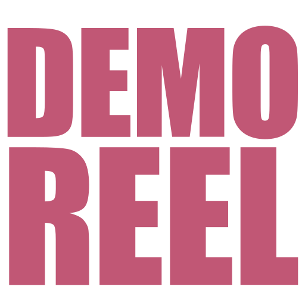

## Hey Hey people!
Welcome to this small wiki. It hosts anything from syntax reminders and code snippets to workflows and template files. It's mostly meant for my own personal use, so the selection of content might seem a bit messy at times :)

### Who am I?
My name's Florian and I'm an FX TD currently living and working in London. I consider myself a pretty technical person, love tinkering with setups and tools and like to cause all kinds of mayhem for film and TV (and the occasional animated project).

I have ~5 years of experience working in FX and specialise in FX-tooldev, destruction and pyro / volumetrics! Mostly using Houdini these days, but used to work with Max / TP / fumeFX / etc. when I first started.

Have a look at my [Reel](https://vimeo.com/451990883) and [Vimeo](https://vimeo.com/florianeggers) pages to see some of my work. You can also find me on [LinkedIn](https://www.linkedin.com/in/florianeggers/) see my photography endeavours on [Instagram](https://www.instagram.com/florian_eggers/).

{: .d-none .d-md-inline-block }

If you want to contact me, the best way is probably via LinkedIn for the time being.
