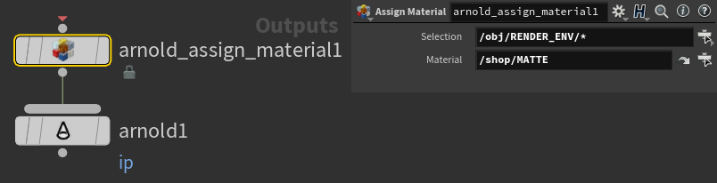
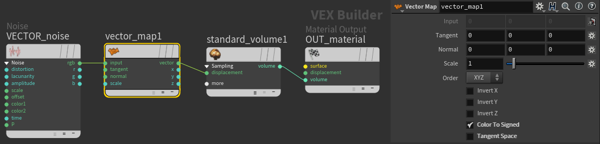

# Arnold
{: .no_toc }

## Table of contents
{: .no_toc .text-delta }

1. TOC
{:toc}

## Override Materials
Overiding materials on a ROP basis using *Assign Material*

## Volume Displacement
Using Vector Noise to displace volume. Need to use a **vector_map** in there with *Color to Signed* on and *Tangent Space* off.

