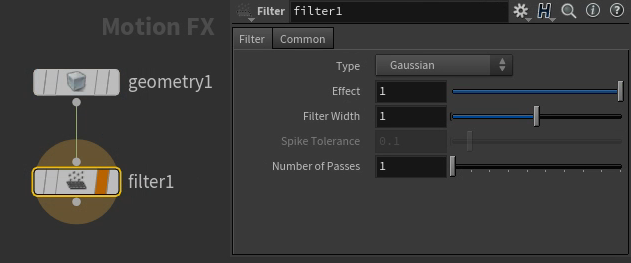

# ~Black Magic~ CHOPs
{: .no_toc }

## Table of contents
{: .no_toc .text-delta }

1. TOC
{:toc}

## Smooth particle jitter
Smooth high frequency movement postsim. Also useful for RBDs.
Note: Plugging in the filecache directly lead to Houdini crashing, creating tmp points solved the issue.


VEX Wrangle:
```
// create_template_points
// Run over DETAIL

int npts = npoints(1);

for(int i = 0; i < npts; i++){
    addpoint(0, 0);
}
```
Inside the chopnet:

