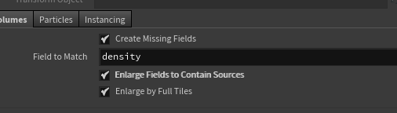

# DOPs
{: .no_toc }

## Table of contents
{: .no_toc .text-delta }

1. TOC
{:toc}

## Sparse Pyro Solver
When trying to source unconnected (sparse) VDBs using the Source Volume DOP, check Enlarge Fields to Contain Sources to properly use the entire field.

## Fake cluster setup
See [Misc - Fake cluster setup](misc.md#fake-cluster-setup) for the setup.
