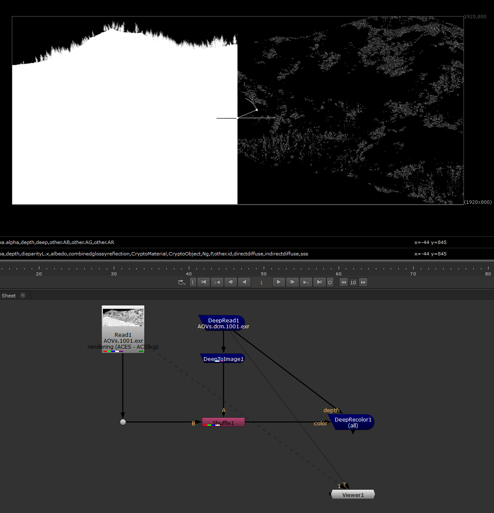

# Navigation Structure
{: .no_toc }

## Table of contents
{: .no_toc .text-delta }

1. TOC
{:toc}

Learning LOPs feels like learning Houdini all over again. Painful :(

## Multiple Materials with Geometry subsets
How to assign multiple materials to a single geo in LOPs? When importing geo, in the Import Data section, use either *Subset Groups* or *Partition Attributes* to split a geometry into subsets.

## Instancing WIP
Was quite a pain in the ass to get to work for the first time, but alas... In this example we want to instance multiple different variants of a static tree, all variants sharing the same material. The steps involved are:
- Authoring the instances, creating .usd files
- Combining all seeds / variations into USD variants
- Exporting combined USD asset
- Importing stuff in LOPs
- Setting up instancer

Creating combined USD asset:

Setting up LOPs:

How to assign multiple materials to a single geo in LOPs? When importing geo, in the Import Data section, use either *Subset Groups* or *Partition Attributes* to split a geometry into subsets.

## MaterialX stuff
### transformation spaces
Rather annoyingly, nodes like the transformvector don't offer any key for what a space acually is: from materialX.org:

The following values are supported by the space inputs of Geometric nodes:
● "model": The local coordinate space of the geometry, before any local deformations or global
transforms have been applied.
● "object": The local coordinate space of the geometry, after local deformations have been applied,
but before any global transforms.
● "world": The global coordinate space of the geometry, after local deformations and global
transforms have been applied.

## Karma broken DCM exrs
When rendering deep from camera, the alpha of the main (AOV) image is broken. Shuffling in the alpha from the DCM exr seems to work.
Top left, the (correct) DCM alpha. Top right, the broken main AOV alpha. Bottom, how to fix in nuke.

