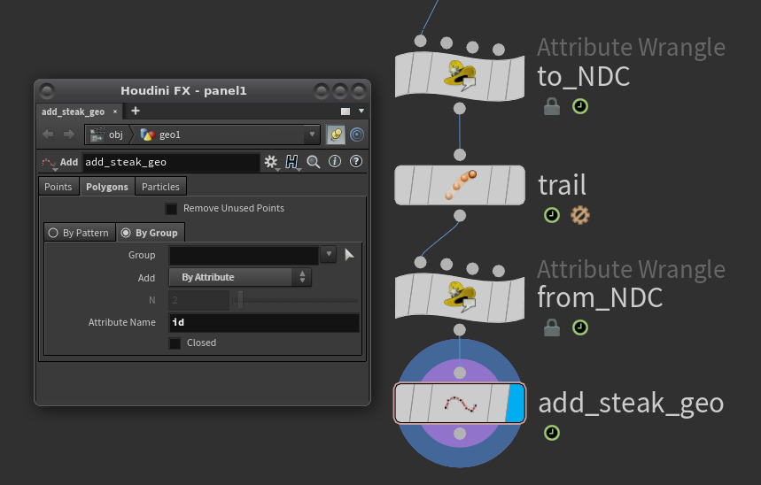
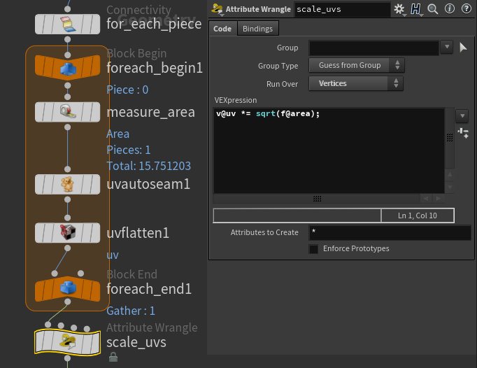
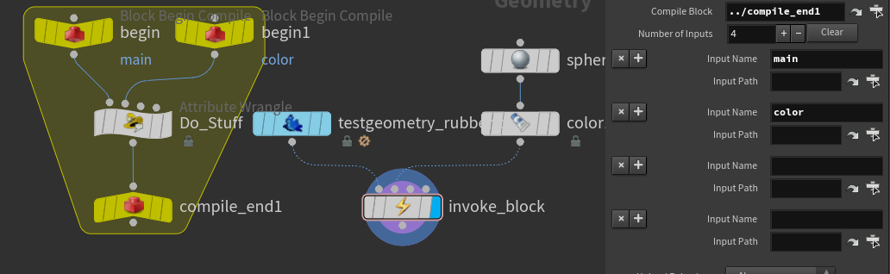

# SOPs
{: .no_toc }

## Table of contents
{: .no_toc .text-delta }

1. TOC
{:toc}

## Curves and Polypath reminders
* **Convert Line** - Split single polyline into segments
* **Polypath** - Reverse of Convert Line
* **Resample** - Aside from resampling, can calculate curveu
* **Ends** - set u to unroll to keep edges


## Geometry based MB
Useful as one can manipulate the streak shape with SOPs. Also super cheap to get curved streaks or introduce high-frequency subframe jitter. The Example is the most basic version, just straight streaks.



Wrangles:
```
// To NDC
@P = toNDC(chs('CameraPath'), @P);
i@id = @ptnum;

// From NDC
@P = fromNDC(chs('CameraPath'), @P);
```

## UVs
Uniform UVs for fractured pieces.



## Compiled Blocks
Quick reminders on how these yellow boys work. Compiled Blocks can be invoked by simply **matching the Input names**:


