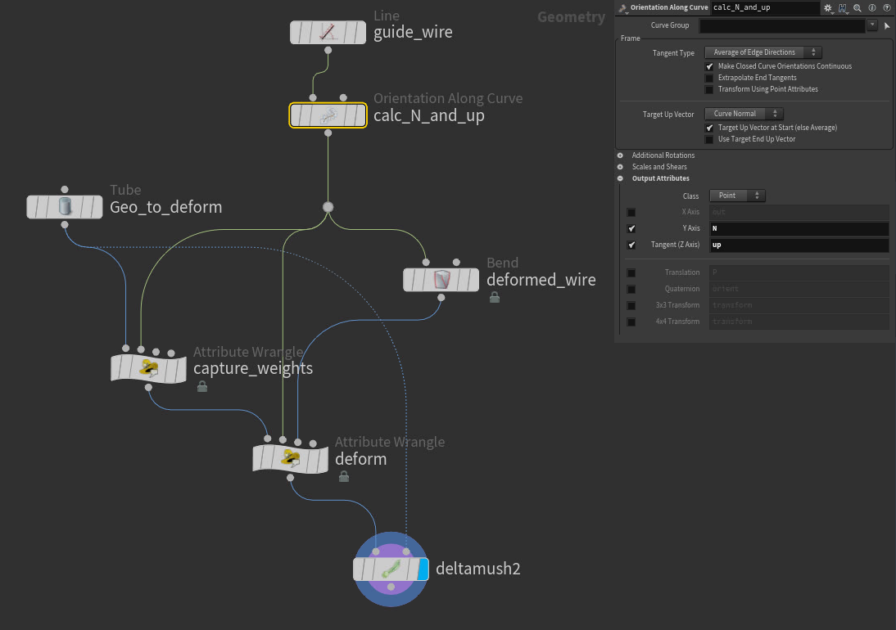

# VEX Snippets
{: .no_toc }

## Table of contents
{: .no_toc .text-delta }

1. TOC
{:toc}

## VEX equivalents for SOPs
### Carve / Cut poly line
```
  // Need to measure perimeter before this wrangle
  import <groom.h>
  float cut = 0.5 // Where to cut along the line
  adjustPrimLength(0, i@primnum, f@perimeter, f@perimeter * cut);
```

### Polywire
```
  // Needs:
  //  v@tangent
  //  v@bitangent
  // Can use polyframe to generate those

  int npts = npoints(0);
  int segments = chi('Segments');
  float radius = chf('radius');

  removeprim(0, @primnum, 0); //Don't need the original prims, just easier to iterate over

  // For each point
  for(int i = 0; i < npts; i++){

      /* Generate ring
          For each original point, generate a ring of points at the origin. Then transform
          the ring to align with the original point. */

      for(int s = 0; s < segments; s++){
          float angle = 2 * PI / segments * s;
          vector newpos = set(sin(angle), cos(angle), 0) * radius;

          // allign with original points
          vector t = point(0, "tangent", i);
          vector b = point(0, "bitangent", i);
          matrix m = maketransform(t, b, point(0, "P", i));

          addpoint(0, newpos * m);
      }
      removepoint(0, i);


      /* Generate polys
          The Original points are still present during th wrangle, therefore when
          building the polys, (npts) has to be added to the current ptnum to get the
          new first point. */

      if(i < npts - 1){
          for(int p = 0; p < segments; p++){
              int pts[] = array(
                  npts+segments*i+p,
                  npts+segments*(i+1)+p,
                  p == segments - 1 ? npts+segments*(i+1)+p+1 - segments : npts+segments*(i+1)+p+1,
                  p == segments - 1 ? npts+segments*i+p+1 - segments : npts+segments*i+p+1
              );
              addprim(0, "poly", pts);
          }
      }
  }

  // Cap Ends
  int end1[], end2[];
  for(int e = 0; e < segments; e++){
      append(end1, npts + e);
      append(end2, npts * segments + npts - e - 1);
  }
  addprim(0, "poly", end1);
  addprim(0, "poly", end2);
```

## Camera Culling
Simple camera culling through ```i@cull``` attribute. Works on prims or points.
```
  vector2 padding = chu('Pading'); // Default could be {0.1, 0.1}
  vector2 zcull = chu('ZCull'); // Default could be {0.1, 99}
  vector screenPos = toNDC(chs('CameraPath'), @P) - 0.5;

  if( abs(screenPos.x) > 0.5 + padding.x ||
      abs(screenPos.y) > 0.5 + padding.y ||
      -screenPos.z < zcull.x || -screenPos.z > zcull.y ){
      i@cull = 1;
  }
```

## VEX skinning
~~Shitty~~ Simple skinning setup. Used to replace the wire-capture & deformer as it caused problems on a shot.
Has two components, a weight-capture wrangle and a skin-deform wrangle. Needs ```v@N``` and ```v@up``` on the guide/rest geo.



Wrangles:
```
// SKIN CAPTURE

int maxbones = chi("maxbones");
float maxdist = chf("maxdist");

float weights[], nweights[];
float sum;

i[]@bones = nearpoints(1, @P, 1, maxbones);

for(int i = 0; i < len(@bones); i++){
    vector bP = point(1, "P", @bones[i]);
    float dist = maxdist - distance(@P, bP);
    push(weights, dist);
}

// fit to max dist
foreach(float weight; weights){
    float x = fit(weight, 0, maxdist, 0, 1);
    push(nweights, x);
}

// normalize weights
weights = {};
sum = sum(nweights);

foreach(float weight; nweights){
    float x = weight / sum;
    push(weights, x);
}

// assign to attrib
f[]@weights = weights;
```

```
// SKIN DEFORM

int bones[] = i[]@bones;
vector positions[];

for(int i = 0; i < len(bones); i++){
    int bone = bones[i];
    vector restN, deformN;
    vector restUp, deformUp;
    vector restP, deformP;

    restN = point(1, "N", bone);
    deformN = point(2, "N", bone);
    restP = point(1, "P", bone);

    restUp = point(1, "up", bone);
    deformUp = point(2, "up", bone);
    deformP = point(2, "P", bone);

    matrix deformM = maketransform(deformN, deformUp, deformP);
    matrix restM = maketransform(restN, restUp, restP);
    premul(deformM, invert(restM));

    push(positions, (@P * deformM) * f[]@weights[i]);
}

@P = sum(positions);

// Adding a deltamush SOP after helps a lot in some cases
```


## Removing NaNs
Remove NAN primitives by looping over every point and checking the```@P``` attribute for a NAN value.
```
  //PrimitiveWrangle
  int cull_prim = 0;
  int pt;
  vector pos;

  for (int i=0; i < primvertexcount(0, @primnum); i++) {

      // convert the prim vertex -> linear vertex -> point number
      pt = vertexpoint(0, vertexindex(0, @primnum, i));

      pos = point(0, "P", pt);
      if (isnan(pos.x) || isnan(pos.y) || isnan(pos.z)) {
          cull_prim = 1;
          break;
      }
  }

  if (cull_prim)
    removeprim(0, @primnum, 1);
```
